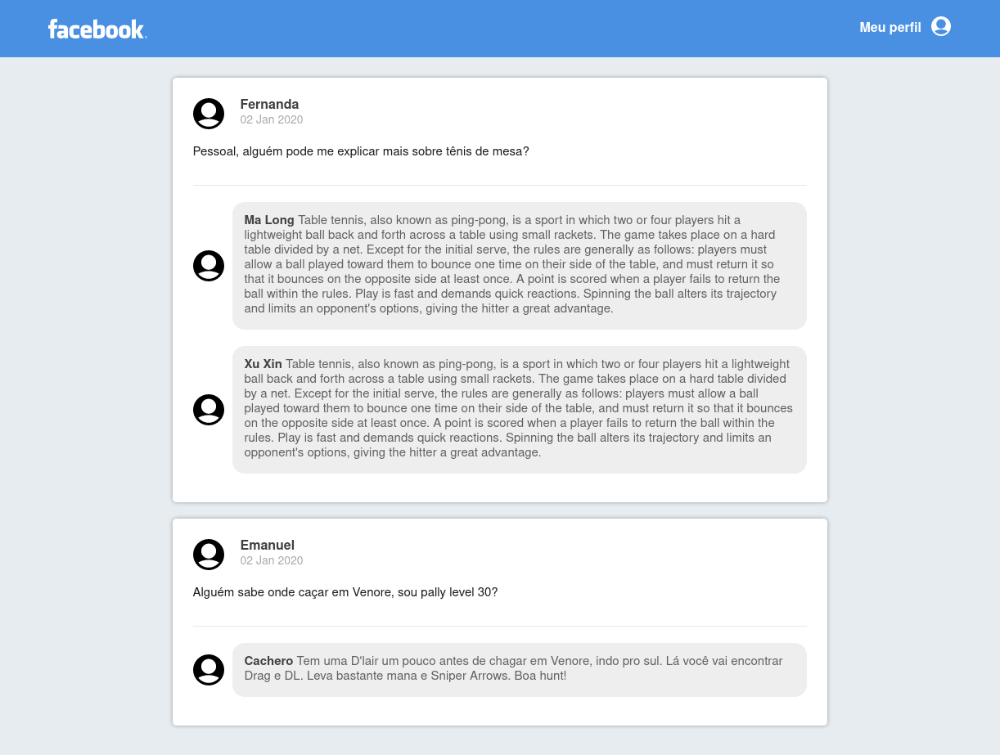

<h1 align="center">
  
</h1>

<h3 align="center">
  :rocket: [Bootcamp GoStack#10] Desafio 04
</h3>

## Desafio
Desenvolver uma interface semelhante ao do Facebook utilizando React.
As informações contidas na interface não precisam refletir nenhuma API REST ou back-end.

[Link do Desafio](https://github.com/Rocketseat/bootcamp-gostack-desafio-04/blob/a5f8f5dd7ae9815aac0ee213304a9b6cc456ea7b/README.md)

### Resultado

<h1 align="center">
  
</h1>